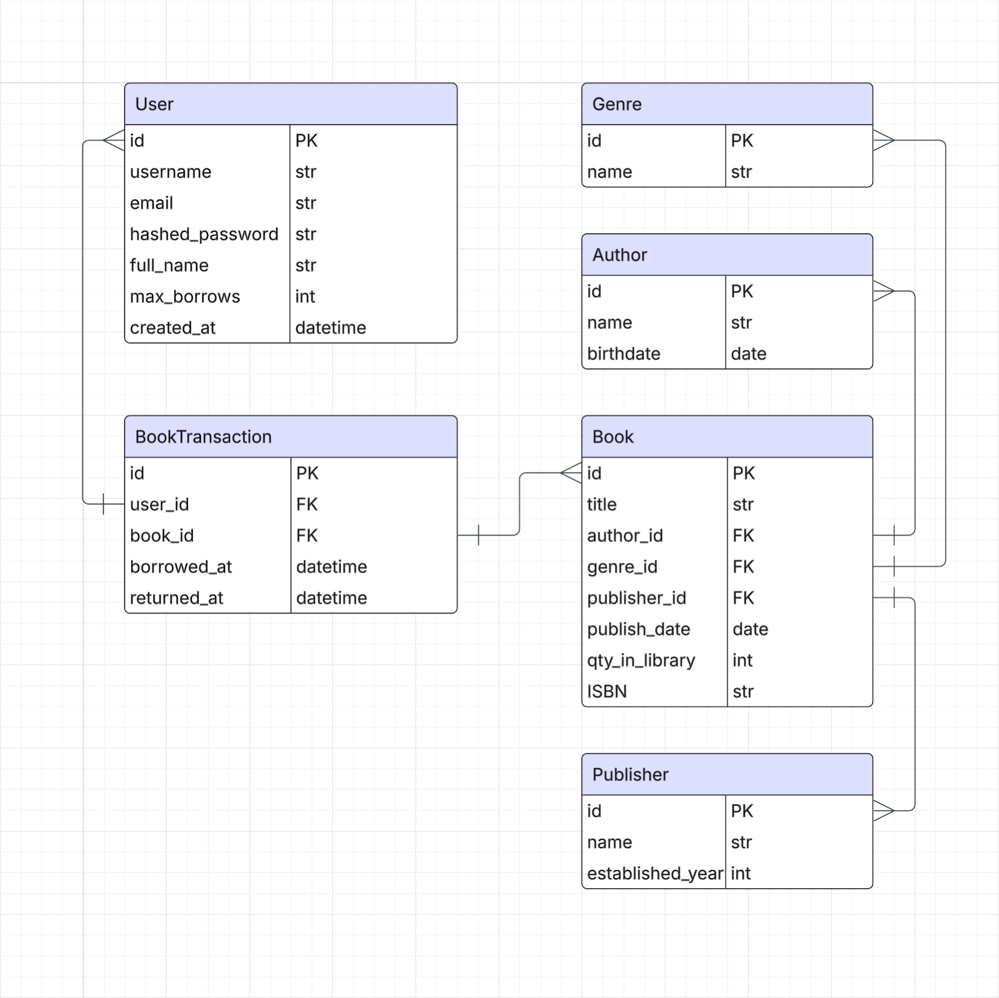

# Library Management System
How to install:
1) Clone project
2) Rename .env_example to .env (no changes in the file)
3) Open the terminal in project directory and run following commands
4) docker compose build
5) docker compose run app sh -c "alembic revision --autogenerate -m "init""
6) docker compose run app sh -c "alembic upgrade head" 
7) Now you are ready to go!

## API Documentation
[View API Docs](https://nero1933.github.io/library-management-system/)

## Endpoints
In progress...

## Database structure

